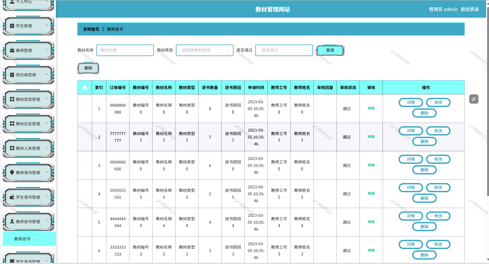

# python077
python077基于Python+Django的教材管理系统+LW+PPT
 
## 查看主页获取源码

### 一、关键词
教材信息管理系统，教学资料管理系统，教材库存管理系统

### 二、作品包含
源码+数据库+设计文档万字+PPT+全套环境和工具资源+本地部署教程

### 三、项目技术
前端技术：Vue2.0、Element-ui
后端技术：Python3.7、Django2.0

### 四、运行环境（以下版本亲测，其他版本兼容性请自行测试）
开发工具：PyCharm + VSCODE

数据库：MySQL5.7（最低要5.7版本）

数据库管理工具：Navicat10+

Python：Python3.7

前端Nodejs：14

浏览器：谷歌浏览器

### 五、项目介绍
项目编号：python077

实现了教材管理网站技术的发展随后依照传统的软件开发流程，最先为系统挑选适用的言语和软件开发平台，依据需求分析开展控制模块制做和数据库查询构造设计，随后依据系统整体功能模块的设计，制作系统的功能模块图、E-R图。随后，设计框架，依据设计的框架撰写编码，完成系统的每个功能模块。最终，对基本系统开展了检测，包含软件性能测试、单元测试和性能指标。测试结果表明，该系统能够实现所需的功能，运行状况尚可并无明显缺点。

### 六、运行截图

